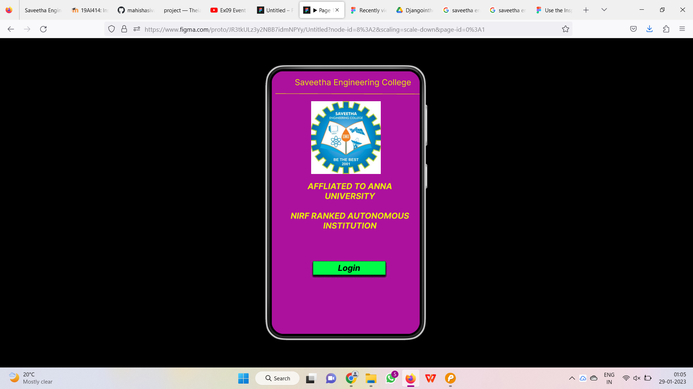
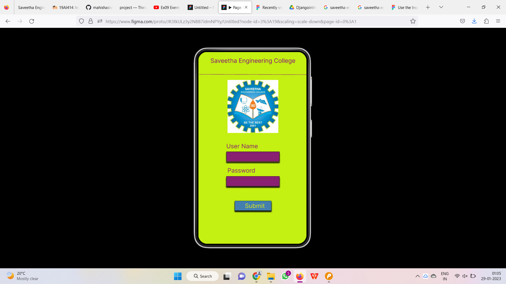
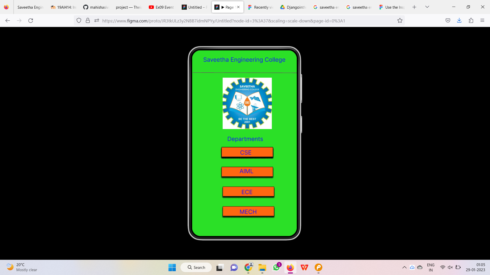
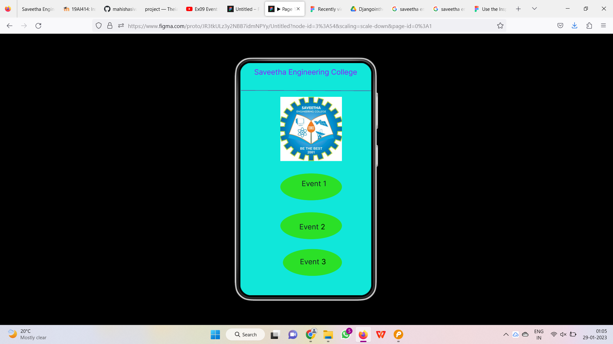
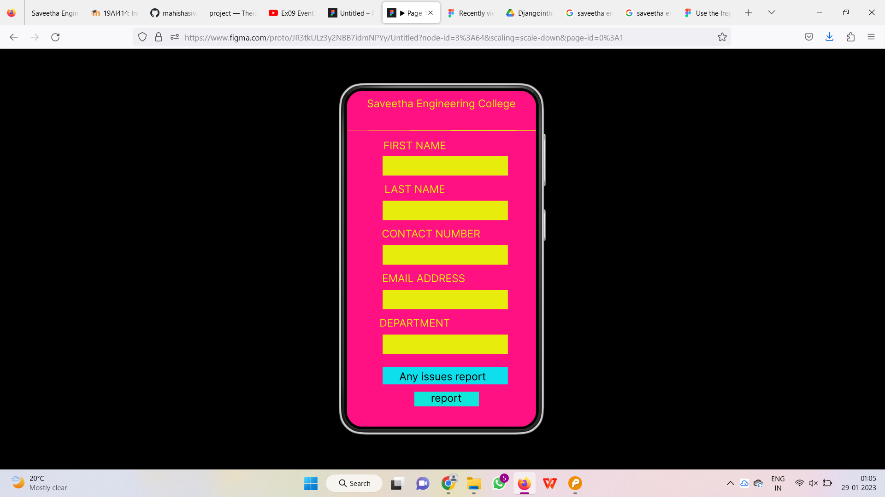
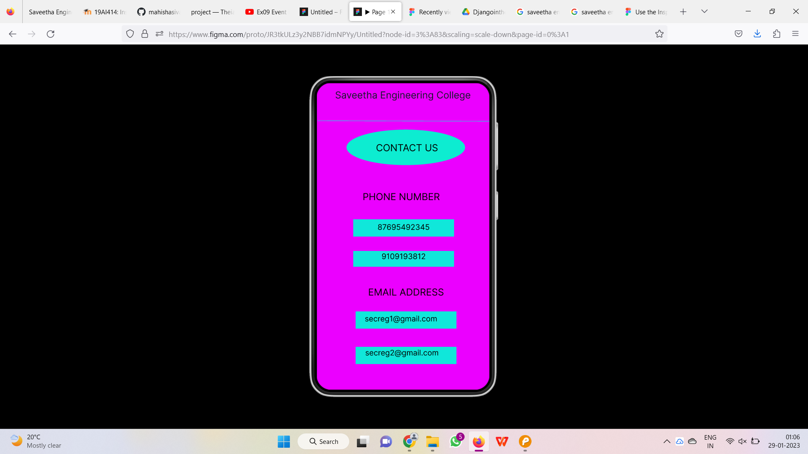
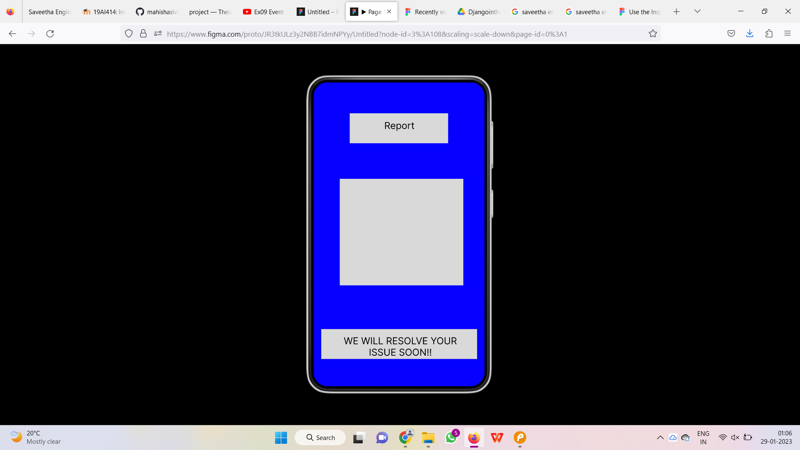
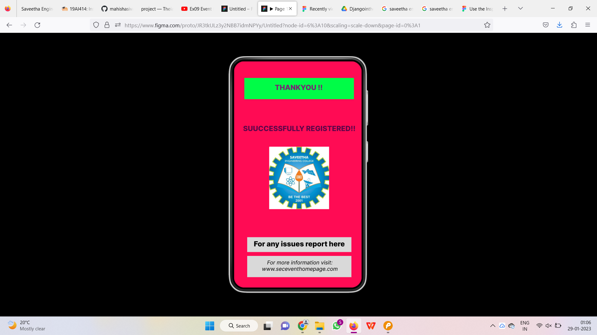

# Event Registration Web Application

## AIM:
To design, develop and deploy a web application for event registration.

## DESIGN STEPS:

### Step 1:
 Create number of pages as needed.
### Step 2:
 Design the web pages.
### Step 3:
 Create HTML and CSS codes for the web pages.
### Step 4:
Add the needed images for web pages.
### Step 5:
Add styles for webpages.
### Step 6:
Validate the HTML and CSS code.

### Step 6:

Publish the website in the given URL.

## DESIGN:

## PROGRAM :
/* Saveetha Engineering College */

position: absolute;
width: 299px;
height: 23px;
left: 48px;
top: 15px;

font-family: 'Inter';
font-style: normal;
font-weight: 400;
font-size: 20px;
line-height: 24px;
text-align: center;

color: #E8EC0D;

/* Line 3 */

position: absolute;
width: 358px;
height: 0px;
left: 9px;
top: 55px;

border: 1px solid #E8EC0D;
transform: rotate(0.16deg);

/* saveethalogo 3 */

position: absolute;
width: 169px;
height: 177px;
left: 96px;
top: 73px;

background: url(saveethalogo.jpg);

/* saveethalogo 4 */

position: absolute;
width: 169px;
height: 177px;
left: 96px;
top: 73px;

background: url(saveethalogo.jpg);

/* Rectangle 5 */

box-sizing: border-box;

position: absolute;
width: 177px;
height: 34px;
left: 100px;
top: 462px;

background: #00FC47;
box-shadow: 0px 4px 4px rgba(0, 0, 0, 0.25), 0px 4px 4px rgba(0, 0, 0, 0.25), 0px 4px 4px rgba(0, 0, 0, 0.25), 0px 4px 4px rgba(0, 0, 0, 0.25), 0px 4px 4px rgba(0, 0, 0, 0.25), 0px 4px 4px rgba(0, 0, 0, 0.25), 0px 4px 4px rgba(0, 0, 0, 0.25), 0px 4px 4px rgba(0, 0, 0, 0.25);

/* AFFLIATED TO ANNA UNIVERSITY NIRF RANKED AUTONOMOUS INSTITUTION */

position: absolute;
width: 314px;
height: 88px;
left: 33px;
top: 268px;

font-family: 'Inter';
font-style: italic;
font-weight: 700;
font-size: 20px;
line-height: 24px;
text-align: center;

color: #E8EC0D;

/* Login */

position: absolute;
width: 152px;
height: 24px;
left: 112px;
top: 467px;

font-family: 'Inter';
font-style: italic;
font-weight: 700;
font-size: 20px;
line-height: 24px;
text-align: center;

color: #000000;

/* Saveetha Engineering College */

position: absolute;
width: 299px;
height: 23px;
left: 30px;
top: 20px;

font-family: 'Inter';
font-style: normal;
font-weight: 400;
font-size: 20px;
line-height: 24px;
text-align: center;

color: #1611FF;

/* Line 3 */

position: absolute;
width: 358px;
height: 0px;
left: 2px;
top: 77px;

border: 1px solid rgba(134, 14, 122, 0.92);
transform: rotate(0.16deg);

/* saveethalogo 3 */

position: absolute;
width: 169px;
height: 177px;
left: 105px;
top: 94px;

background: url(saveethalogo.jpg);

/* Rectangle 5 */

box-sizing: border-box;

position: absolute;
width: 177px;
height: 34px;
left: 101px;
top: 333px;

background: #FF6711;
border: 1px solid #000000;
box-shadow: 0px 4px 4px rgba(0, 0, 0, 0.25), 0px 4px 4px rgba(0, 0, 0, 0.25), 0px 4px 4px rgba(0, 0, 0, 0.25), 0px 4px 4px rgba(0, 0, 0, 0.25), 0px 4px 4px rgba(0, 0, 0, 0.25), 0px 4px 4px rgba(0, 0, 0, 0.25), 0px 4px 4px rgba(0, 0, 0, 0.25);

/* Rectangle 9 */

box-sizing: border-box;

position: absolute;
width: 177px;
height: 34px;
left: 101px;
top: 333px;

background: #FF6711;
border: 1px solid #000000;
box-shadow: 0px 4px 4px rgba(0, 0, 0, 0.25), 0px 4px 4px rgba(0, 0, 0, 0.25), 0px 4px 4px rgba(0, 0, 0, 0.25), 0px 4px 4px rgba(0, 0, 0, 0.25), 0px 4px 4px rgba(0, 0, 0, 0.25), 0px 4px 4px rgba(0, 0, 0, 0.25), 0px 4px 4px rgba(0, 0, 0, 0.25);

/* Rectangle 6 */

box-sizing: border-box;

position: absolute;
width: 177px;
height: 34px;
left: 101px;
top: 401px;

background: #FF6711;
border: 1px solid #000000;
box-shadow: 0px 4px 4px rgba(0, 0, 0, 0.25), 0px 4px 4px rgba(0, 0, 0, 0.25), 0px 4px 4px rgba(0, 0, 0, 0.25), 0px 4px 4px rgba(0, 0, 0, 0.25), 0px 4px 4px rgba(0, 0, 0, 0.25), 0px 4px 4px rgba(0, 0, 0, 0.25), 0px 4px 4px rgba(0, 0, 0, 0.25);

/* Rectangle 7 */

box-sizing: border-box;

position: absolute;
width: 177px;
height: 34px;
left: 105px;
top: 469px;

background: #FF6711;
border: 1px solid #000000;
box-shadow: 0px 4px 4px rgba(0, 0, 0, 0.25), 0px 4px 4px rgba(0, 0, 0, 0.25), 0px 4px 4px rgba(0, 0, 0, 0.25), 0px 4px 4px rgba(0, 0, 0, 0.25), 0px 4px 4px rgba(0, 0, 0, 0.25), 0px 4px 4px rgba(0, 0, 0, 0.25), 0px 4px 4px rgba(0, 0, 0, 0.25);

/* Rectangle 8 */

box-sizing: border-box;

position: absolute;
width: 177px;
height: 34px;
left: 105px;
top: 537px;

background: #FF6711;
border: 1px solid #000000;
box-shadow: 0px 4px 4px rgba(0, 0, 0, 0.25), 0px 4px 4px rgba(0, 0, 0, 0.25), 0px 4px 4px rgba(0, 0, 0, 0.25), 0px 4px 4px rgba(0, 0, 0, 0.25), 0px 4px 4px rgba(0, 0, 0, 0.25), 0px 4px 4px rgba(0, 0, 0, 0.25), 0px 4px 4px rgba(0, 0, 0, 0.25);

/* Departments */

position: absolute;
width: 161px;
height: 19px;
left: 121px;
top: 293px;

font-family: 'Inter';
font-style: normal;
font-weight: 400;
font-size: 20px;
line-height: 24px;

color: #1611FF;
/* CSE */
position: absolute;
width: 213px;
height: 19px;
left: 78px;
top: 340px;

font-family: 'Inter';
font-style: normal;
font-weight: 400;
font-size: 20px;
line-height: 24px;
text-align: center;

color: #1611FF;
/* AIML */
position: absolute;
width: 177px;
height: 31px;
left: 163px;
top: 404px;

font-family: 'Inter';
font-style: normal;
font-weight: 400;
font-size: 20px;
line-height: 24px;

color: #1611FF;
/* ECE */

position: absolute;
width: 161px;
height: 19px;
left: 130px;
top: 476px;

font-family: 'Inter';
font-style: normal;
font-weight: 400;
font-size: 20px;
line-height: 24px;

color: #1611FF;
/* MECH */

position: absolute;
width: 161px;
height: 19px;
left: 163px;
top: 544px;
font-family: 'Inter';
font-style: normal;
font-weight: 400;
font-size: 20px;
line-height: 24px;
color: #1611FF;
/* Saveetha Engineering College */
position: absolute;
width: 299px;
height: 23px;
left: 30px;
top: 13px;
font-family: 'Inter';
font-style: normal;
font-weight: 400;
font-size: 20px;
line-height: 24px;
text-align: center;

color: #9611FF;
/* Line 4 */
position: absolute;
width: 358px;
height: 0px;
left: 2px;
top: 76px;
border: 1px solid rgba(134, 14, 122, 0.92);
transform: rotate(0.16deg);
/* saveethalogo 4 */
position: absolute;
width: 169px;
height: 177px;
left: 110px;
top: 93px;
background: url(saveethalogo.jpg);
/* Ellipse 1 */
position: absolute;
width: 169px;
height: 74px;
left: 110px;
top: 304px;
background: #2BE027;
/* Ellipse 2 */
position: absolute;
width: 169px;
height: 74px;
left: 110px;
top: 411px;
background: #2BE027;
/* Ellipse 3 */
position: absolute;
width: 162px;
height: 74px;
left: 117px;
top: 512px;
background: #2BE027;
/* Event 1 */
position: absolute;
width: 75px;
height: 46px;
left: 165px;
top: 320px;
font-family: 'Inter';
font-style: normal;
font-weight: 400;
font-size: 20px;
line-height: 24px;
text-align: center;

color: #16182A;
/* Event 2 */

position: absolute;
width: 75px;
height: 46px;
left: 160px;
top: 439px;

font-family: 'Inter';
font-style: normal;
font-weight: 400;
font-size: 20px;
line-height: 24px;
text-align: center;

color: #16182A;
/* Event 3 */

position: absolute;
width: 75px;
height: 46px;
left: 162px;
top: 535px;

font-family: 'Inter';
font-style: normal;
font-weight: 400;
font-size: 20px;
line-height: 24px;
text-align: center;

color: #16182A;
/* Saveetha Engineering College */

position: absolute;
width: 299px;
height: 23px;
left: 30px;
top: 12px;

font-family: 'Inter';
font-style: normal;
font-weight: 400;
font-size: 20px;
line-height: 24px;
text-align: center;

color: #E8EC0D;

/* Line 5 */

position: absolute;
width: 358px;
height: 0px;
left: 2px;
top: 75px;

border: 1px solid #E8EC0D;
transform: rotate(0.16deg);
/* Line 6 */

position: absolute;
width: 358px;
height: 0px;
left: 2px;
top: 75px;

border: 1px solid #E8EC0D;
transform: rotate(0.16deg)
/* Rectangle 10 */

position: absolute;
width: 238px;
height: 37px;
left: 68px;
top: 124px;

background: #D9D9D9;
/* Rectangle 11 */

position: absolute;
width: 238px;
height: 37px;
left: 68px;
top: 124px;

background: #E8EC0D;
/* Rectangle 12 */

position: absolute;
width: 238px;
height: 37px;
left: 68px;
top: 209px;

background: #E8EC0D;
/* Rectangle 13 */

position: absolute;
width: 238px;
height: 37px;
left: 68px;
top: 294px;

background: #E8EC0D;
/* Rectangle 14 */

position: absolute;
width: 238px;
height: 37px;
left: 68px;
top: 379px;

background: #E8EC0D;

/* Rectangle 15 */

position: absolute;
width: 238px;
height: 37px;
left: 68px;
top: 464px;

background: #E8EC0D;

/* Rectangle 16 */

position: absolute;
width: 238px;
height: 33px;
left: 68px;
top: 526px;

background: #0DDFEC;

/* FIRST NAME */

position: absolute;
width: 282px;
height: 21px;
left: -12px;
top: 92px;

font-family: 'Inter';
font-style: normal;
font-weight: 400;
font-size: 20px;
line-height: 24px;
text-align: center;

color: #E8EC0D;
/* LAST NAME */

position: absolute;
width: 282px;
height: 21px;
left: -12px;
top: 175px;

font-family: 'Inter';
font-style: normal;
font-weight: 400;
font-size: 20px;
line-height: 24px;
text-align: center;

color: #E8EC0D;
/* CONTACT NUMBER */

position: absolute;
width: 282px;
height: 21px;
left: -12px;
top: 260px;

font-family: 'Inter';
font-style: normal;
font-weight: 400;
font-size: 20px;
line-height: 24px;
text-align: center;

color: #E8EC0D;

/* EMAIL ADDRESS */

position: absolute;
width: 282px;
height: 21px;
left: -12px;
top: 345px;

font-family: 'Inter';
font-style: normal;
font-weight: 400;
font-size: 20px;
line-height: 24px;
text-align: center;

color: #E8EC0D;
/* DEPARTMENT */

position: absolute;
width: 282px;
height: 21px;
left: -12px;
top: 430px;

font-family: 'Inter';
font-style: normal;
font-weight: 400;
font-size: 20px;
line-height: 24px;
text-align: center;

color: #E8EC0D;
/* Any issues report */

position: absolute;
width: 176px;
height: 22px;
left: 94px;
top: 532px;

font-family: 'Inter';
font-style: normal;
font-weight: 400;
font-size: 20px;
line-height: 24px;
text-align: center;

color: #000000;
/* Rectangle 17 */

position: absolute;
width: 123px;
height: 28px;
left: 128px;
top: 573px;

background: #10E7DA;
/* report */

position: absolute;
width: 82px;
height: 30px;
left: 148px;
top: 573px;

font-family: 'Inter';
font-style: normal;
font-weight: 400;
font-size: 20px;
line-height: 24px;
text-align: center;

color: #000000;
/* Saveetha Engineering College */

position: absolute;
width: 299px;
height: 23px;
left: 30px;
top: 13px;

font-family: 'Inter';
font-style: normal;
font-weight: 400;
font-size: 20px;
line-height: 24px;
text-align: center;

color: #16182A;

/* Line 7 */

position: absolute;
width: 358px;
height: 0px;
left: 2px;
top: 79px;

border: 1px solid #29D4DF;
transform: rotate(0.16deg);

/* Ellipse 4 */

position: absolute;
width: 247px;
height: 74px;
left: 62px;
top: 97px;

background: #0DECD1;
/* CONTACT US */

position: absolute;
width: 132px;
height: 11px;
left: 122px;
top: 123px;

font-family: 'Inter';
font-style: normal;
font-weight: 400;
font-size: 20px;
line-height: 24px;
text-align: center;

color: #000000;
/* PHONE NUMBER */

position: absolute;
width: 210px;
height: 21px;
left: 71px;
top: 225px;

font-family: 'Inter';
font-style: normal;
font-weight: 400;
font-size: 20px;
line-height: 24px;
text-align: center;

color: #000000;
/* Rectangle 18 */

position: absolute;
width: 210px;
height: 36px;
left: 76px;
top: 284px;

background: #10E7DA;
/* Rectangle 20 */

position: absolute;
width: 210px;
height: 36px;
left: 81px;
top: 476px;

background: #10E7DA;
/* Rectangle 21 */

position: absolute;
width: 210px;
height: 36px;
left: 81px;
top: 550px;

background: #10E7DA;
/* Rectangle 19 */

position: absolute;
width: 210px;
height: 33px;
left: 76px;
top: 350px;
background: #10E7DA;
/* 9109193812 */
position: absolute;
width: 132px;
height: 5px;
left: 115px;
top: 352px;
font-family: 'Inter';
font-style: normal;
font-weight: 400;
font-size: 16px;
line-height: 19px;
text-align: center;
color: #000000;
/* 87695492345 */
position: absolute;
width: 144px;
height: 23px;
left: 109px;
top: 291px;
font-family: 'Inter';
font-style: normal;
font-weight: 400;
font-size: 16px;
line-height: 19px;
text-align: center;
color: #000000;
/* Any problems report here */
position: absolute;
width: 287px;
height: 28px;
left: 966px;
top: 452px;
font-family: 'Inter';
font-style: normal;
font-weight: 800;
font-size: 20px;
line-height: 24px;
text-align: center;
color: #16182A;
/* secreg1@gmail.com */
position: absolute;
width: 157px;
height: 23px;
left: 97px;
top: 482px;
font-family: 'Inter';
font-style: normal;
font-weight: 400;
font-size: 16px;
line-height: 19px;
text-align: center;
color: #000000;
/* secreg2@gmail.com */
position: absolute;
width: 163px;
height: 23px;
left: 96px;
top: 553px;
font-family: 'Inter';
font-style: normal;
font-weight: 400;
font-size: 16px;
line-height: 19px;
text-align: center;
color: #000000;
/* EMAIL ADDRESS */
position: absolute;
width: 190px;
height: 35px;
left: 91px;
top: 424px;
font-family: 'Inter';
font-style: normal;
font-weight: 400;
font-size: 20px;
line-height: 24px;
text-align: center;
color: #000000;
/* Rectangle 22 */
position: absolute;
width: 207px;
height: 63px;
left: 76px;
top: 65px;
background: #D9D9D9;
/* Rectangle 23 */
position: absolute;
width: 260px;
height: 224px;
left: 55px;
top: 203px;
background: #D9D9D9;
/* Report */
position: absolute;
width: 175px;
height: 33px;
left: 93px;
top: 79px;
font-family: 'Inter';
font-style: normal;
font-weight: 400;
font-size: 20px;
line-height: 24px;
text-align: center;
color: #000000;
/* Rectangle 24 */
position: absolute;
width: 328px;
height: 63px;
left: 16px;
top: 519px;
background: #D9D9D9;
/* WE WILL RESOLVE YOUR ISSUE SOON!! */
position: absolute;
width: 255px;
height: 36px;
left: 55px;
top: 532px;
font-family: 'Inter';
font-style: normal;
font-weight: 400;
font-size: 20px;
line-height: 24px;
text-align: center;
color: #000000;
/* Rectangle 26 */
position: absolute;
width: 309px;
height: 60px;
left: 29px;
top: 47px;
background: #00FC47;
/* THANKYOU !! */
position: absolute;
width: 233px;
height: 37px;
left: 66px;
top: 62px;
font-family: 'Inter';
font-style: normal;
font-weight: 800;
font-size: 20px;
line-height: 24px;
text-align: center;
color: rgba(134, 14, 122, 0.92);
/* SUUCCESSFULLY REGISTERED!! */
position: absolute;
width: 324px;
height: 29px;
left: 22px;
top: 178px;
font-family: 'Inter';
font-style: normal;
font-weight: 800;
font-size: 20px;
line-height: 24px;
text-align: center;
color: rgba(80, 4, 72, 0.92);
/* Rectangle 27 */
position: absolute;
width: 294px;
height: 42px;
left: 37px;
top: 497px;
background: #D9D9D9;
/* For any issues report here */
position: absolute;
width: 294px;
height: 28px;
left: 37px;
top: 504px;
font-family: 'Inter';
font-style: normal;
font-weight: 800;
font-size: 20px;
line-height: 24px;
text-align: center;
color: #000000;
/* Rectangle 28 */
position: absolute;
width: 294px;
height: 60px;
left: 37px;
top: 550px;
background: #D9D9D9;
/* For more information visit: www.seceventhomepage.com */
position: absolute;
width: 265px;
height: 42px;
left: 53px;
top: 560px;
font-family: 'Inter';
font-style: italic;
font-weight: 400;
font-size: 15px;
line-height: 18px;
text-align: center;
color: #000000;
/* saveethalogo 5 */
position: absolute;
width: 169px;
height: 177px;
left: 99px;
top: 241px;
background: url(saveethalogo.jpg);

## OUTPUT:

## Result:
he program to design, develope and deploy a web application for event registration is completed.

